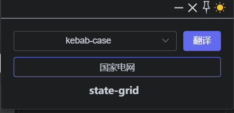

# 🥳 变量生成工具2.0

> 基于 electron-vite-vue 模板
>
> electron支持多操作系统，目前只做了windows端的适配，因为笔记本是windows的

## 使用/Usage

下载安装exe文件，输入中文，自动生成英文变量，并自动复制，支持驼峰与横线两种模式

## 效果图

## 新特性/New Features

- 不占任务栏，托盘显示
- 自定义eletron默认边框与菜单
- 更加小巧更加美观
- 增加固定图标功能
- 黑白主题切换

## 卸载/Uninstall

右击桌面图标，打开文件位置，点击uninstall文件即可

